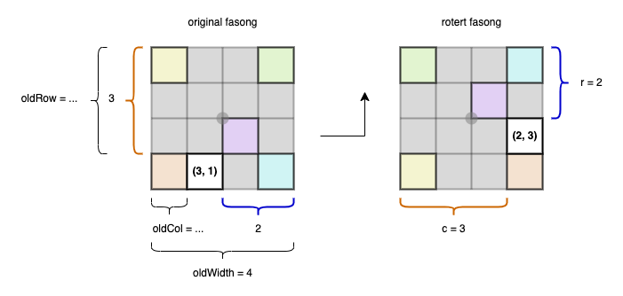

[forrige](./04-flyttebrikke.md) &bullet; [oversikt](../README.md#steg-for-steg) &bullet; [neste](./06-droppebrikke.md)

# 5 Rotere brikken

Når du er ferdig med dette kapittelet, kan du rotere brikken ved å trykke på pil-opp -tasten.

- I `Tetromino` -klassen, opprett en metode for å lage en rotert kopi av seg selv.
- Begynn med å skrive testene for dette i *TestTetromino*: skriv for eksempel en test for `T` -brikken.

Illustrasjonen viser rotasjon av et rutenett generelt.

> Hint: opprett en ny `boolean[][]` i riktig størrelse og benytt en dobbel for-løkke over rad og kolonne i den nye fasongen. For hver posisjon (r, c) regn ut hvilken posisjon dette tilsvarer i den originale fasongen, og hent verdien derfra.
> 
> ***Q:** Hvilken verdi skal ruten (r, c) i rotert fasong ha?*
> **A:** Samme verdi som (oldRow, oldCol) i original fasong, der
> oldRow = ... (sett inn matematisk uttrykk her)
> oldCol = ... (sett inn matematisk uttrykk her)
> For eksempel: hvis (r, c) er (2, 3) og bredden på original fasong er 4, da er (oldRow, oldCol) = (3, 1)

Når testen din for rotasjonen passerer, er du klar til å fortsette:

- I `ControllableTetrisModel` definerer vi en metode for å rotere brikken.
- I `TetrisController` kaller vi overnevnte metode når brukeren trykker pil opp.
- I `TetrisModel` implementerer vi metoden på samme måte som vi gjorde for flyttingen: henter en rotert kopi, sjekker om den er lovlig, og hvis ja: oppdater feltvariabelen.
- I `TestTetrisModel`, skriv en metode som tester metoden som roterer den fallende tetrominoen.

---

:white_check_mark:  Du er ferdig med dette kapittelet når du kan rotere brikken ved å trykke på pil-opp -tasten. Pass på at du ikke kan rotere brikken "ut av brettet," at brikken ikke kan rotere slik at den legger seg oppå en fargelagt rute, at alle brikkene (også I -brikken) roterer rundt ca sentrum av seg selv, at alle brikkene kommer tilbake til nøyaktig samme posisjon etter fire rotasjoner (to rotasjoner for S og Z), og at O -brikken ikke flytter på seg under rotasjon.

**Frivillig**

Implementer den offisielle rotasjonen [super rotation system](https://tetris.fandom.com/wiki/SRS), hvor det er mulig å «sparke fra» når man roterer i nærheten av en vegg.
